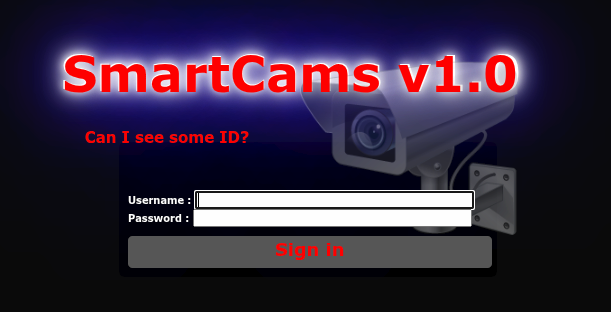

<div align="center">



</div>

# SmartCams v2.0

A professional-grade real-time smart camera monitoring and control system with support for PTZ (Pan-Tilt-Zoom) cameras using the Pelco-D protocol and IP cameras with web interfaces.

## Features

### Camera Control
- **Pelco-D Protocol Support** - Industry-standard PTZ camera control via TCP/IP
  - Pan/Tilt movement control with adjustable speeds
  - Zoom In/Out and Focus Near/Far/Auto
  - 6 Preset positions (save and recall camera positions)
  - IR (Infrared) control for night vision
  - Backlight compensation
  - Auto-focus and manual focus modes
  - Wash/Wipe function for camera lens cleaning

- **Multi-Protocol Camera Support**
  - Pelco-D PTZ cameras (RS-485 over TCP/IP)
  - Web-based IP cameras
  - MJPEG/MPEG stream cameras
  - ESP32-CAM modules

### Real-time Features
- Live camera feed viewing with Socket.IO
- Instant command execution and feedback
- Multi-camera grid view (configurable 2x2, 3x2, 4x2 layouts)
- Tab-based organization for large camera installations

### Security & Performance
- **Role-Based Access Control** (Admin, User, Guest)
- Session management with automatic reconnection
- Rate limiting (10 commands per second per client)
- Command validation whitelist for security
- Input sanitization and validation

## Technologies

- **Backend**: Node.js, Express.js
- **Real-time Communication**: Socket.IO (bidirectional WebSocket communication)
- **Template Engine**: EJS (server-side rendering)
- **Session Management**: express-session with cookie-based persistence
- **Network Protocol**: TCP/IP sockets for Pelco-D communication
- **Protocol**: Pelco-D (7-byte hexadecimal command structure)

## Technical Details

### Pelco-D Protocol Implementation

The system implements the **Pelco-D protocol**, a widely-used standard for controlling PTZ cameras. Each command consists of a 7-byte hexadecimal string:

```
[Start Byte][Address][Command 1][Command 2][Data 1][Data 2][Checksum]
```

**Supported Commands:**
- **Movement**: Up, Down, Left, Right, Stop
- **Zoom**: Zoom In, Zoom Out
- **Focus**: Near, Far, Auto, Manual
- **Presets**: Set/Recall 6 preset positions
- **Auxiliary**: IR On/Off, Backlight On/Off, Wash/Wipe

Commands are sent via TCP sockets to the camera's control port, allowing network-based control of serial PTZ cameras through RS-485 to Ethernet converters.

### Camera Types

1. **Pelco-D Cameras**: Professional PTZ cameras with full motion control
2. **Pelco-D-Web Hybrid**: PTZ control + web-based video streaming
3. **Web Cameras**: Standard IP cameras with HTTP/RTSP streams
4. **MPEG Stream Cameras**: Motion JPEG or MPEG stream sources
5. **ESP32-CAM**: Budget-friendly WiFi camera modules

### Architecture

- **Server-side rendering** using EJS templates for dynamic camera layouts
- **Socket.IO event system** for real-time command/response
- **Session persistence** across browser refreshes
- **Rate limiting** to prevent command flooding and hardware damage
- **Command validation** using whitelist pattern for security

## Installation

1. Clone the repository:
```bash
git clone git@github.com:Bi7Wis3/SmartCams_v2.0.git
cd SmartCams_v2.0
```

2. Install dependencies:
```bash
npm install
```

3. Set up configuration files:
   ```bash
   cd config/

   # Copy server config (defines users)
   cp _serverconfig.example.json _serverconfig.json

   # Copy camera configs - IMPORTANT: Each user needs their own file!
   cp _cameraconfig.example.json _cameraconfig.json        # Fallback config
   cp admin.cams.example.json admin.cams.json              # For user "admin"
   cp user.cams.example.json user.cams.json                # For user "user"

   # Edit configurations
   nano _serverconfig.json        # Add users, change passwords
   nano admin.cams.json           # Assign cameras to admin
   nano user.cams.json            # Assign cameras to user
   ```

   **Important:** Each username in `_serverconfig.json` must have a matching `[username].cams.json` file!

   See `config/README.md` for detailed configuration instructions

4. Start the server:
```bash
npm start
```

## Usage

1. Access the web interface at `http://localhost:[PORT]` (default port is defined in `config/_serverconfig.json`)

2. **Login** with your credentials (if authentication is enabled)
   - Admins: Full access to all cameras and configuration
   - Users: Access to assigned cameras
   - Guests: View-only access

3. **Control Cameras**:
   - Click directional arrows for Pan/Tilt
   - Use zoom controls for optical zoom
   - Save preset positions for quick positioning
   - Toggle IR/backlight for different lighting conditions

### Configuration Files

The `config/` directory contains template files (`.example.json`) that you copy and customize:

- `_serverconfig.json` - Server settings, users, and authentication
- `_cameraconfig.json` - Default camera configuration
- `[username].cams.json` - Per-user camera assignments (one file per user!)

### Pelco-D Camera Setup

For RS-485 Pelco-D cameras, you'll need:
- An RS-485 to Ethernet converter
- Camera address set on the PTZ camera (usually 1-255)
- Network configuration in the camera config file:
  - `cip`: IP address of the RS-485 converter
  - `cport`: TCP port (typically 4001)
  - `id`: Camera address matching the hardware setting

## Project Structure

- `server.js` - Main server file with Socket.IO and Pelco-D logic
- `public/` - Static assets (images, CSS, JavaScript)
  - `public/includes/` - Client-side JavaScript
  - `public/css/` - Stylesheets
  - `public/images/` - UI icons and control buttons
- `views/cameras/` - EJS templates for camera rendering
  - `camera.ejs` - Individual camera block template
  - `buttons-pelcod.ejs` - PTZ control interface
  - `buttons-web.ejs` - Web camera controls
- `config/` - Configuration files (not included in repo for security)

## Security Features

- **Command Whitelist**: Only predefined commands are executed
- **Rate Limiting**: Maximum 10 commands per second per client
- **Input Validation**: All camera commands are validated before execution
- **Role-Based Access**: Three-tier permission system (Admin/User/Guest)
- **Session Security**: HTTP session with secure cookie storage
- **No Command Injection**: Hex-encoded Pelco-D commands prevent injection attacks

## Troubleshooting

**Camera not responding to Pelco-D commands:**
- Verify camera address matches configuration
- Check RS-485 converter IP and port
- Ensure camera baud rate matches converter settings (usually 2400 or 9600)
- Test TCP connection: `telnet [converter-ip] [port]`

**Video feed not loading:**
- Check camera IP and URL in configuration
- Verify network connectivity to camera
- Test stream URL directly in browser or VLC

**Rate limiting errors:**
- Reduce command frequency (max 10/second)
- Check for multiple clients controlling same camera

## License

ISC

## Author

Bi7Wis3
